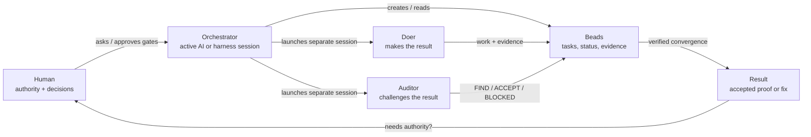
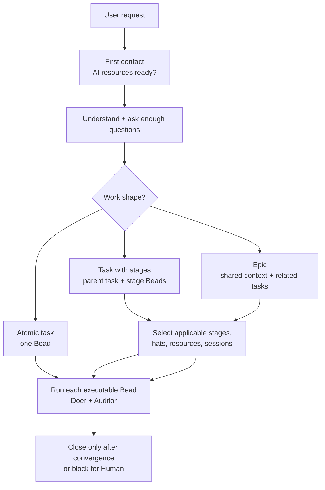

# Multiple Beaded Agents (MBA)

MBA is a copy-and-use workflow that lets one or more AI sessions work as a
small project team on top of [Beads](https://github.com/gastownhall/beads).



## In one table

| Question | MBA answer |
|---|---|
| What is it? | A thin Orchestrator + Doer + Auditor workflow on top of Beads. |
| Who is the Orchestrator? | The active AI/harness session that reads MBA instructions. The human is the authority, not the Orchestrator. |
| What is the quality rule? | Every executable Bead needs Doer-vs-Auditor convergence: verified fix or accepted proof. |
| Does it run by itself? | No. MBA is instruction-driven, not a daemon. It runs when an AI/tool/harness follows the installed instructions. |
| Can it run invisibly? | Yes, if the chosen harness launches the Orchestrator invisibly. MBA also launches OpenCode Doer/Auditor workers hidden by default. |
| Is PyPI used now? | No. `v0.1.0` is installable from the public GitHub repo/tag. PyPI is a separate future decision. |
| What is private? | Beads data, `.mba-work`, credentials, local AI-resource config, and dev instruction files stay out of the public repo. |

## Install MBA

Current public release:

```bash
python -m pip install -U git+https://github.com/Khubaeb/MultipleBeadedAgents.git@v0.1.0
```

Developer install from a clone:

```bash
git clone https://github.com/Khubaeb/MultipleBeadedAgents.git
cd MultipleBeadedAgents
python -m pip install -e .
```

Console scripts:

| Command | Module |
|---|---|
| `mba` | `python -m mba_foundation` |
| `mba-foundation` | `python -m mba_foundation` |
| `mba-runtime` | `python -m mba_runtime` |
| `mba-primitives` | `python -m mba_primitives` |

Check:

```bash
mba --version
```

## Prerequisite: Beads

| Item | Current requirement |
|---|---|
| Required CLI | `bd` |
| Validated version | `bd 1.0.4` |
| Version policy | Refuse mismatches; no silent Beads upgrade. |
| Beads install/init | Requires user authority when missing. |

```bash
bd version
```

## Add MBA to a project

```bash
cd /path/to/project
mba init
mba status
```

`mba init` adds a managed MBA surface:

| Path | Purpose | Existing content |
|---|---|---|
| `AGENTS.md` | MBA rules for Codex/OpenAI-style agents | Marker block is inserted/replaced; surrounding project text is preserved. |
| `CLAUDE.md` | Same MBA rules for Claude-style agents | Same marker/manifest protection. |
| `.agents/skills/mba/SKILL.md` | Copy-and-use MBA skill | Copied verbatim from MBA. |
| `opencode.json` | OpenCode default agent config | Copied if safe. |
| `.opencode/agents/mba.md` | OpenCode Orchestrator agent | Copied if safe. |
| `.opencode/agents/mba-worker.md` | OpenCode Doer/Auditor worker agent | Copied if safe. |
| `docs/...` | Local MBA docs referenced by the installed skill/rules | Copied if safe. |
| `.mba/manifest.json` | Installed-file checksums and version | Local install state; not public project history. |

Safety:

| Situation | MBA behavior |
|---|---|
| Existing `AGENTS.md` / `CLAUDE.md` with no MBA block | Adds only the MBA block; preserves existing text. |
| Unchanged previous MBA block | Replaces it during upgrade. |
| User-edited MBA block | Reports conflict and refuses overwrite. |
| `mba remove` | Removes MBA-managed blocks/files and `.mba/manifest.json`; preserves `.beads` and `.mba-work`. |

## First contact in a project

When an AI starts work in an MBA-installed repo, it runs:

```bash
bd version
python -m mba_runtime first-contact --cwd . --apply-setup
```

| Result | Next step |
|---|---|
| AI resources ready | Orchestrator can create/read Beads and launch Doer/Auditor sessions. |
| AI resources missing/incomplete | Runtime creates/updates a blocked `MBA setup` Bead, assigns `Human`, asks setup questions, and stops. |

The private AI-resource file is:

```text
.mba-work/.ai-resources.json
```

Minimum OpenCode resource:

```json
{
  "id": "minimax-m3-max",
  "label": "MiniMax-M3 Max via OpenCode",
  "capabilities": ["doer", "auditor"],
  "session_lifetime": "fresh_per_session",
  "launch": {
    "tool": "opencode",
    "model": "minimax-coding-plan/MiniMax-M3",
    "variant": "max"
  }
}
```

`id` is a local nickname. Worker launches use `launch.model` and
`launch.variant`.

## Responsibilities, roles, and stages

### Three workflow responsibilities

| Responsibility | Meaning |
|---|---|
| Orchestrator | Coordinates Beads, setup, assignments, launch receipts, gates, closure. Stays thin. |
| Doer | Produces the result and evidence. |
| Auditor | Challenges the Doer and verifies evidence. |

### Organizational roles are hats

| Example hat | Can be worn by |
|---|---|
| Researcher | Doer or Auditor |
| Engineer | Doer or Auditor |
| Designer | Doer or Auditor |
| QA / Reviewer | Usually Auditor, but still an organizational role, not a fourth responsibility. |

### How a task flows



| Shape | Beads shape | Notes |
|---|---|---|
| Atomic task | One task Bead | No Epic, no unnecessary subtasks. |
| Task with stages | Parent task + required child task Beads | Only applicable stages are created. |
| Epic-level goal | Epic + related tasks; tasks may have child stage Beads | Shared understanding/selection lives at the epic level; each task asks only task-specific questions. |

Stages are dynamic. MBA uses the smallest complete set needed for the work,
not a fixed pipeline.

| Common stage | Purpose |
|---|---|
| Understanding | Make the request clear; ask the right questions. |
| Selection | Choose applicable stages, hats, AI resources, session counts, dependencies. |
| Plan | Decide what will be done and why. |
| Build | Produce the requested result. |
| Verify | Challenge, test, prove, or find gaps. |
| Deliver | Close, hand off, or block for human authority. |

## Worker launch and evidence

| Rule | Why |
|---|---|
| Doer and Auditor are separate sessions | One transcript switching hats is not enough. |
| OpenCode workers are launched hidden/background by default | Empty CMD windows are not useful progress. |
| `.mba-work/<bead-id>/<session-name>/` is the worker folder | `<bead-id>` must be the actual Bead ID; a friendly install name, test harness, ref hash, or `.mba-work/<friendly-name>/...` path is refused. |
| `launch.md` is written before reading worker output | Proves the worker existed before the result. |
| `run.log` / `run.err` are captured log files | Durable after restart/disconnect; OpenCode may flush late, so they are not guaranteed token-live. |
| Bead comments are structured summaries | The Bead is the human-facing record. |
| `.mba-work` stores bulky prompts/evidence only when useful | It is support storage, not a second task tracker. |

### Operator contracts

| Contract | Required rule |
|---|---|
| Thin Orchestrator | Orchestrator stays thin; it writes pointer-based worker prompts and does not pre-solve, pre-research, or research diffs for worker work. |
| Workflow tracker | Beads is the only workflow task tracker; do not use TodoWrite or host todo/task trackers. |
| Prompt self-check | Before launch, `prompt.md` must pass the prompt self-check: ≤ 4 KiB, ≤ 60 non-blank lines, source pointers instead of pasted diffs/results, no unified-diff payload like `diff --git`, and no precomputed values like `ahead_by`, `behind_by`, or `total_commits`. |
| Launch directory | Create the session with `New-Item -ItemType Directory -Force -Path $session`; do not pre-check the parent folder with `Split-Path -Parent` / `Test-Path` or create a `Missing parent` failure. |
| Resume after restart | Orchestrator resume after restart reads `launch.md`, `report.md`, `comment.md`, and verdict files, then follows wait → resume → relaunch → blocked/Human; never leave a Bead silently `in_progress`. |
| Targeted reads | Routine recovery uses `bd show <bead-id>`, `bd ready`, `bd list --status=...`, `bd list --label=...`, `bd list --assignee=...`, or `bd search`; `bd list --all` is not routine. |
| Verdict file | Auditor `_verdict.txt` is mandatory when requested; missing verdict evidence is not `ACCEPT`; do not infer `ACCEPT` from `report.md` or a Bead comment. |
| Comment budget | Normally 4-16 non-blank structured Markdown lines; no report-like dump, no static Bead-field repeat, and do not paste the prompt or transcript. |
| Auditor checks | Auditor must return `FIND` for overlong/report-like worker comments, comments that paste prompts/transcripts/static Bead fields, or any known wrong fact in user-facing deliverable content unless proven non-load-bearing; “descriptive”, “minor”, or “useful context” is not enough. |
| User-authority gate | Git push, Dolt sync, deploy, external message, credentials/spend, destructive work, and reusable workflow changes need human approval; otherwise block for `Human`, never silently `in_progress`; a `ready-for-user-*` label alone is not enough. |

## Beads features used

| Beads capability | MBA use |
|---|---|
| Tasks / Epics / child tasks | Core work hierarchy. |
| Dependencies / readiness | Core ordering and parallelism. |
| Labels / status / assignee / priority | Core visibility and ownership. |
| Comments | Core human-facing progress, decisions, evidence summaries. |
| Dolt sync | Core private Beads synchronization for dev/team state. |
| Formulas / molecules / wisps / bonds / gates / distillation | Conditional: use only when a documented case is simpler than direct Beads, validated on the target Beads version, and approved by the user. |
| Official Beads plugin / MCP | Optional integration, not a portable-core dependency. |

Details: [`docs/beads/capabilities.md`](docs/beads/capabilities.md).

## Update or remove MBA in a project

| Need | Command |
|---|---|
| Upgrade the MBA tool from GitHub | `python -m pip install -U git+https://github.com/Khubaeb/MultipleBeadedAgents.git@v0.1.0` |
| Preview installed-content refresh | `mba upgrade --dry-run` |
| Apply installed-content refresh | `mba upgrade` |
| Preview removal | `mba remove --dry-run` |
| Remove MBA-managed content | `mba remove` |

After upgrading the tool, run:

```bash
mba upgrade --dry-run
mba upgrade
python -m mba_runtime first-contact --cwd . --apply-setup
```

Upgrade preserves `.mba-work/.ai-resources.json`; it asks only for missing or
newly required setup.

## Safety gates

MBA pauses for human authority before:

| Gate | Examples |
|---|---|
| Source control | Git commit/push, Dolt push/pull. |
| External effects | Deploy, publish, send message. |
| Sensitive resources | Credentials, spending, metered use. |
| Destructive work | Delete, overwrite, force-push, history rewrite. |
| Workflow adoption | Changing reusable MBA behavior. |

If accepted work is waiting only on authority, MBA blocks the Bead, assigns
`Human`, adds `human`, and records the decision needed.

## Current limits

| Limit | Status |
|---|---|
| Public package index | Not on PyPI yet. Install from GitHub tag. |
| Beads support | Validated on `bd 1.0.4`; widening requires revalidation. |
| Automatic in-loop resource fallback | Library/CLI exists; full `drive-bead` dispatch wiring remains roadmap. |
| Token-level live stream | Not promised; captured logs are process/event streams. |
| Hidden Orchestrator transcript capture | Harness-owned. MBA records MBA milestones and worker artefacts. |

## Docs

| Page | Use it for |
|---|---|
| [`docs/USER_GUIDE.md`](docs/USER_GUIDE.md) | Install, setup, upgrade, remove. |
| [`docs/mba/README.md`](docs/mba/README.md) | Docs index and feature map. |
| [`docs/mba/charter.md`](docs/mba/charter.md) | Normative workflow contract. |
| [`docs/mba/non-technical-flow.md`](docs/mba/non-technical-flow.md) | Plain-language flow. |
| [`docs/mba/technical-flow.md`](docs/mba/technical-flow.md) | Runtime/modules/dispatch details. |
| [`docs/mba/implementation-status.md`](docs/mba/implementation-status.md) | Built vs deferred. |
| [`docs/mba/roadmap.md`](docs/mba/roadmap.md) | Planned improvements. |
| [`docs/beads/capabilities.md`](docs/beads/capabilities.md) | Beads-native feature decisions. |
| [`docs/beads/evaluation.md`](docs/beads/evaluation.md) | Evidence behind Beads feature decisions. |

## License

MIT.
