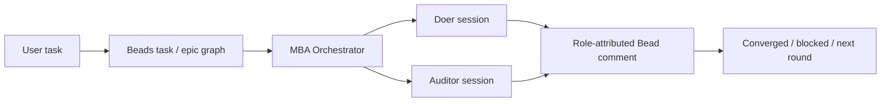

# Beads evaluation record

> Why MBA uses Beads as its core layer. The normative decision table is
> [`capabilities.md`](capabilities.md); this file explains the reasoning.

## Evaluation boundary

| Area | Decision |
|---|---|
| Foundation version | `bd 1.0.4` is the validated foundation set. |
| Advanced-feature reference | Beads `v1.1.0` advanced workflow features were studied as optional future tools. |
| Evidence rule | Use official docs/source plus disposable-repo tests; do not infer behavior from intent. |
| Public boundary | Detailed private worker transcripts stay out of the public repo. This file carries the reusable conclusions only. |

## Why Beads

MBA needs a durable work graph without becoming a second task database.

| MBA need | Native Beads fit |
|---|---|
| Atomic tasks | `task` issues |
| Larger goals | `epic` issues |
| Task-with-stages | parent/child issue hierarchy |
| Sequencing | `blocks` dependencies |
| Parallel branches + joins | multiple blockers on one issue |
| Discoveries during work | `discovered-from` dependency |
| Human handoff | blocked status + human assignee/label + comments |
| Team visibility | comments, statuses, assignees, priorities |
| Local durability | embedded Dolt database |
| Cross-machine sync | `bd dolt push/pull`, separate from source Git |

## Core decision

MBA keeps Beads as the system of record and adds only:

- AI-resource setup;
- stage/role selection;
- Doer/Auditor launch discipline;
- evidence-required convergence;
- user-authority gates;
- packaging / install / upgrade helpers.

## Feature decisions

| Beads feature | MBA classification | Why |
|---|---|---|
| Direct `bd` CLI | Core | Smallest portable interface; works across agents that can run shell commands. |
| `task` / `epic` | Core | Matches atomic work and grouped project goals. |
| Parent/child issues | Core | Represents task-with-stages without redefining epics. |
| `blocks` dependencies | Core | Handles sequence, parallel branches and joins. |
| `discovered-from` | Core | Captures scout/follow-up work found during execution. |
| `bd ready` / `bd blocked` / `bd dep cycles` | Core | Native readiness and graph safety checks. |
| Comments / assignees / labels / statuses | Core | Human-readable state and role attribution. |
| Embedded Dolt | Core | Local durable history; not published with source code. |
| Dolt sync | Core but gated | Useful for private/dev collaboration; requires user authority. |
| Formulas / protos / molecules / wisps / bonds / gates | Conditional | Useful for repeatable advanced workflows, but not needed for the smallest complete foundation. |
| Official Beads plugin / MCP | Excluded from portable core | Host-specific; direct CLI stays simpler and more universal. |
| JSONL import/export as sync | Excluded | JSONL is a snapshot/export, not the live sync protocol. |
| Custom MBA issue types/statuses | Excluded | Native Beads fields are sufficient. |

## Why advanced features are conditional

| Feature group | Could help with | Why not default |
|---|---|---|
| Formulas / molecules | Reusable complex workflow templates. | MBA stages are dynamic per task; a fixed template can add setup weight. |
| Wisps | Temporary runtime scratch. | They are not the durable cross-machine record. |
| Bonds | Wiring advanced workflows. | Adds authoring/model complexity; not required for first-release portability. |
| Gates | External checks such as timers or CI/PR states. | Availability depends on Beads version and host integrations. |
| Promote / distill / squash | Curating long-running workflow state. | Valuable later; not required to make the core loop work. |

## Version policy

| Rule | Reason |
|---|---|
| Record `bd version` before live writes. | Prevents silent behavior drift. |
| Use only capabilities validated for that version. | Keeps MBA reproducible. |
| Never silently upgrade Beads. | Tool upgrades can change workflow semantics. |
| Revalidate before adopting newer Beads features. | Advanced features are conditional, not assumed. |

## Residual decisions

| Topic | Default | When to revisit |
|---|---|---|
| `.mba-work` mode | Local / Git-ignored. | A team explicitly wants shared bulky evidence. |
| Advanced Beads layer | Not used by default. | A repeatable workflow becomes stable enough to template. |
| Dolt sync destination | User-approved private/dev remote. | Each repo chooses its collaboration policy. |
| Plugin/MCP route | Not a core dependency. | A host cannot run the `bd` CLI directly. |
