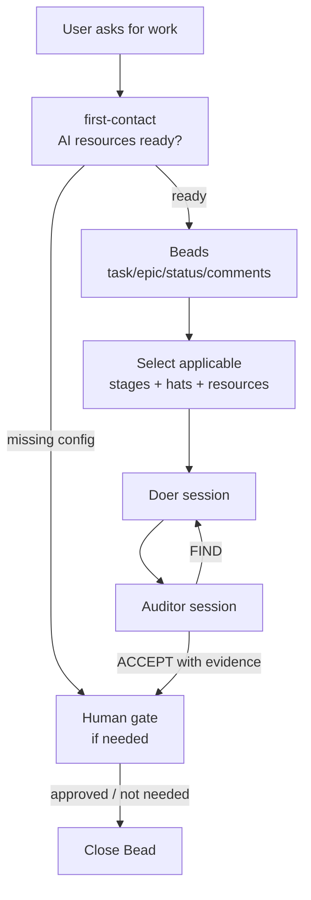

# MBA docs index

MBA turns AI sessions into a configurable project team on top of Beads.
The active AI/harness session is the **Orchestrator**. The human remains the
authority for decisions and external effects.

## Fast map



## Read in this order

| Need | File |
|---|---|
| Public quickstart | [`../../README.md`](../../README.md) |
| Install/setup/upgrade/remove | [`../USER_GUIDE.md`](../USER_GUIDE.md) |
| Normative rules | [`charter.md`](charter.md) |
| Plain-language walkthrough | [`non-technical-flow.md`](non-technical-flow.md) |
| Runtime/module details | [`technical-flow.md`](technical-flow.md) |
| Built vs deferred | [`implementation-status.md`](implementation-status.md) |
| Future work | [`roadmap.md`](roadmap.md) |
| Beads feature decisions | [`../beads/capabilities.md`](../beads/capabilities.md) |
| Beads research evidence | [`../beads/evaluation.md`](../beads/evaluation.md) |
| Visual assets | [`assets/`](assets) |

## Required startup gate

```powershell
bd version
python -m mba_runtime first-contact --cwd . --apply-setup
```

## Product shape

| Dimension | Decision |
|---|---|
| Workflow responsibilities | Exactly three: Orchestrator, Doer, Auditor. |
| Organizational roles | Configurable hats worn by Doer/Auditor, e.g. Researcher, Engineer, QA. |
| Task shapes | Atomic task, task with stages, or epic-level goal. |
| Stage selection | Dynamic per task; only applicable stages are created. |
| Quality rule | Doer and Auditor converge on verified fix or accepted proof. |
| Setup | Per repository/folder; `.mba-work/.ai-resources.json` is private. |
| Operation modes | Visible harness Orchestrator, hidden harness Orchestrator, or OpenCode Orchestrator; workers are separate sessions. |
| Primary record | Beads comments; `.mba-work` only for prompts/logs/bulky evidence when useful. |

## What is built now

| Capability | Status |
|---|---|
| Beads preflight/version gate (`bd 1.0.4`) | Built |
| `mba init`, `mba status`, `mba upgrade`, `mba remove` | Built |
| Marker-managed `AGENTS.md` / `CLAUDE.md` blocks | Built |
| OpenCode Orchestrator + worker install files | Built |
| First-contact setup handoff | Built |
| AI-resource config + deterministic routing | Built |
| Doer/Auditor convergence loop | Built |
| Evidence-required Auditor `ACCEPT` | Built |
| Direct worker `run.log` / `run.err` capture | Built |
| `mba-runtime stream` read-only follower | Built |
| MBA-owned worker cleanup guard | Built |
| Automatic in-loop fallback in `drive-bead` | Planned |
| PyPI publishing | Not part of `v0.1.0` |

## Responsibility split

| Actor/session | Does | Must not |
|---|---|---|
| Human | Gives task, answers questions, approves gates. | Be recorded as author of AI-generated comments. |
| Orchestrator | Coordinates Beads, prompts, launches, evidence checks, closure. | Pre-solve worker work or manufacture convergence. |
| Doer | Produces result and evidence. | Audit its own work. |
| Auditor | Finds issues or accepts with evidence. | Accept without evidence or ignore known contradictions. |

## Beads stance

| Native Beads feature | MBA stance |
|---|---|
| Tasks, epics, dependencies, labels, status, assignee, comments, Dolt sync | Core. |
| Formulas, molecules, wisps, bonds, gates, distillation | Conditional; adopt only with a simpler validated use case and user approval. |
| Official plugin / MCP | Optional; not required for portable core. |

## Version

| Item | Value |
|---|---|
| Current release | `0.1.0` |
| Install source | GitHub tag `v0.1.0` |
| Package name | `multiple-beaded-agents` |
| PyPI | Not published yet. |
