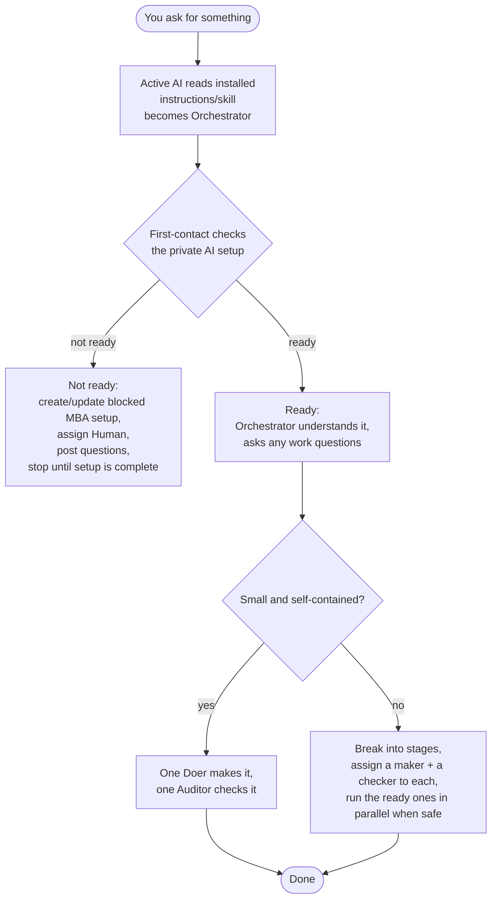
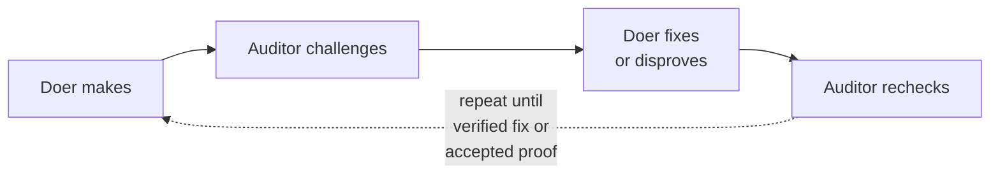

# How MBA works — non-technical flow

> Plain-language walk-through. No code. For the module-level version see
> [`technical-flow.md`](technical-flow.md); for the rules see
> [`charter.md`](charter.md).

## The idea in one picture

## The cast

| Who | In plain terms |
|---|---|
| **Orchestrator** | The coordinator you talk to. It sets up the work and asks you to decide the things only you can decide. It does as little as safely possible. |
| **Doer** | The worker who *makes* the thing (writes the doc, the code, the analysis). |
| **Auditor** | A separate worker who *checks* the thing and pushes back with reasons. |

The Doer and Auditor always work in **separate sessions** so the check is
genuinely independent — even when the same AI plays both, it does so in
fresh sessions wearing opposite "hats".

## The step-by-step

1. **Understand & ask.** The Orchestrator makes the request clear and
   asks every question needed up front.
2. **Classify.** Small self-contained request → keep it as one task.
   Bigger request → split into the stages that actually apply (no
   template bloat).
3. **Assign.** For each stage it picks: what expertise (the "hat"), who
   makes, who checks, and how many sessions the work's importance
   justifies.
4. **Do & challenge.** The Doer produces a result with evidence. The
   Auditor challenges it. The Doer fixes or disproves. The Auditor
   re-checks.
5. **Converge.** They stop only when there is a **verified fix or an
   accepted proof** — not because they ran out of turns and not because
   they simply agree.
6. **Record.** A useful structured summary lands on the issue. Bulky
   prompts, transcripts, evidence or generated files go into a working
   folder only when useful.

## What MBA will never do without asking you

| Action | Why it pauses |
|---|---|
| Commit or push your source code | It's your call to publish work. |
| Push/pull the Beads database to a remote | External, persistent. |
| Deploy, publish, or send an external message | Leaves the repo. |
| Use credentials or anything that costs money | Your resources. |
| Anything destructive | No silent data loss. |
| Adopt a reusable change to the workflow itself | You own the process. |

## When an AI hits a limit

MBA keeps your work moving without losing it or disturbing your own
sessions:

| Situation | What MBA does |
|---|---|
| The assigned AI is rate-limited | Falls back to the **next suitable AI** on your configured list, and **records the swap** — it never quietly drops to a weaker model. |
| A worker session was interrupted | **Resumes** the exact same MBA session (same bead, role, stage, AI, effort) instead of starting over. |
| It's unsure whether a session is the right one to resume | **Asks you** — it will not probe, resume, interrupt, or kill an ambiguous session. |
| You run your *own* Claude / OpenCode sessions in the repo | MBA **leaves them completely alone** — they are never MBA-owned, so they are never touched. |
| Every suitable AI is unavailable | Schedules a **bounded** retry (from the providers' reset times) or a **bounded** probe (when no reset time is given), then pauses for you — it never spins forever and never auto-closes the work. |

## Where to look afterwards

| You want… | Open… |
|---|---|
| The concise status | The Bead's comments. |
| Normal reasoning, evidence, decision and status | The Bead comments. |
| Bulky evidence or generated files | `.mba-work/<bead-id>/<session>/`, only when useful. |
| The combined approved result | `.mba-work/<bead-id>/final/`. |
