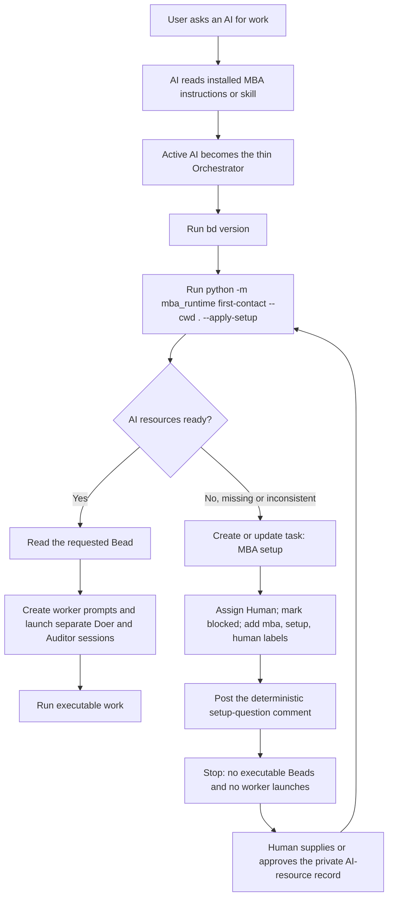

# MBA startup and setup flow

MBA is instruction-driven, not a resident daemon. It activates when an AI reads the installed repository instructions or MBA skill and follows them. Plain `first-contact` is read-only; the preferred `--apply-setup` form writes only the blocked `MBA setup` handoff when AI-resource setup is missing.

## Missing setup handoff

When `.mba-work/.ai-resources.json` is absent, incomplete or inconsistent, `first-contact` returns a `recommended_setup_bead` object. The Orchestrator uses it to create or update the `MBA setup` task, assign it to `Human`, mark it `blocked`, add the `mba`, `setup` and `human` labels, and post the supplied Markdown comment. The comment carries the deterministic setup questions and the resource-preflight reason.

The guidance splits actions into an `allowed_now` list (`create_or_update_setup_bead`, `post_setup_questions`) and a `blocked_until_ready` list (`create_or_drive_executable_beads`, `launch_workers`) so the wording is unambiguous. The Orchestrator stops after that handoff. It must not create or drive executable work Beads or launch Doer/Auditor workers until the record is ready. Rerun `python -m mba_runtime first-contact --cwd . --apply-setup` after setup; a ready result returns to the normal Bead and worker flow.

For each AI resource, setup must record both:

| Field | Purpose |
|---|---|
| `id` | Human-friendly nickname used by teams, such as `minimax-m3-max`. |
| `launch.model` | Real tool/provider model string, such as `minimax-coding-plan/MiniMax-M3`. |

The nickname is not enough to launch a worker. If `launch.tool` or
`launch.model` is missing, first-contact keeps `MBA setup` blocked.

> Prefer the deterministic, runtime-assisted path: the same
> `first-contact --apply-setup` invocation creates or updates the
> blocked `MBA setup` Bead and posts the structured setup question
> comment on the Orchestrator's behalf. The CLI still returns exit
> code `4` so the Orchestrator stops before executable Beads or
> worker launches; the manual hand-written path remains available
> for the few cases that need a custom comment body.

> Prefer the **`python -m mba_runtime …`** module form. The
> `mba-runtime` console script that `pip install` registers is an
> optional shortcut that works only when its install location is on
> `PATH` (Windows `pip install --user` writes it to
> `%APPDATA%\Python\Python3XX\Scripts`, which is not on `PATH` by
> default); the module form needs only a working `python` and the
> installed `mba_runtime` package.

## Find this page

- [`README.md`](README.md) — documentation map and capability summary.
- [`technical-flow.md`](technical-flow.md) — module and pipeline detail.
- [`non-technical-flow.md`](non-technical-flow.md) — plain-language flow.
- [`../USER_GUIDE.md`](../USER_GUIDE.md) — target-project setup instructions.
